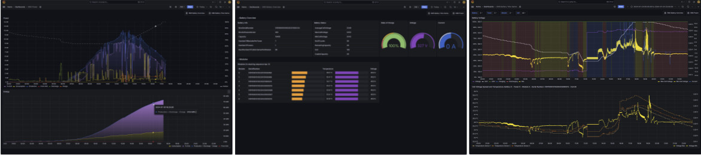

# monitorEMS

The program periodically reads monitoring data from an OpenEMS Energy Management System and stores these as measurements in an InfluxDB V2 database.

For OpenEMS, see: <https://github.com/OpenEMS/openems>

OpenEMS-based systems usually come already with a powerful User Interface including [vizualization and monitoring](https://github.com/OpenEMS/openems?tab=readme-ov-file#openems-ui-screenshots).

**monitorEMS** is intended for users who want to

- integrate EMS monitoring or EMS data with monitoring of other systems, such as a Heat Pump, Home Automation or Weather forecast Systems.
- add monitoring features which are currently not (yet) available in OpenEMS, such as battery monotoring.
- have the historical data of their Energy Management System under their own control

**monitorEMS** uses a **generic** approach for mapping openEMS to Influx datapoints (see [below](#mapping-of-openems-to-influxdb-data-points)).
This allows monitoring virtually all accessible OpenEMS data just by configuration.

For Visualization, some Grafana dashboards are included (see [Visualization](./doc/Vizualization.md)).


## Requirements

In order to use the program, you need

- an **Energy Management System**, based on [OpenEMS](https://github.com/OpenEMS/openems)      
(*monitorEMS* has been developed and tested with a [Fenecon Home 10](https://fenecon.de/en/fenecon-home-10/) system, running [FEMS](https://fenecon.de/en/fenecon-fems/))
- a computer on which [**Docker**](https://www.docker.com/) is running (Windows PC, Linux, e.g. Raspi, NAS, ...), which is available for 24/7 operation.    
(This project has been deployed on a Synology DS220+ Disk Station)
- An **Influx DB V2.x** (eventally running as Docker container)
- A **Grafana** instance for visualization (eventally running as Docker container)

If you are not already running a Docker Engine, see [Install Docker Engine](https://docs.docker.com/engine/install/).    
On NAS systems, Docker is usually available as App in the NAS OS.   
[InfluxDB](https://docs.influxdata.com/influxdb/v2/) is a time series database. *monitorEMS* currently only supports the free **V2.x** version of InfluxDB!   
[Grafana](https://grafana.com/) is an open source analytics and vizualization platform.

## Getting started

The following description assumes running all applications as Docker containers.   
You may alternatively run monitorEMS in a virtual Python environment from the command line (see [below](#running-monitorems-as-python-program)).

| Step | Action                                                                                                                                       |
|------|----------------------------------------------------------------------------------------------------------------------------------------------|
| 1.   | Install and configure an InfluxDB V2 (https://docs.influxdata.com/influxdb/v2/install/)                                                |
| 2.   | In InfluxDB, [create a new bucket](https://docs.influxdata.com/influxdb/v2/admin/buckets/create-bucket/). The *monitorEMS* default configuration assumes "EMS"          |
| 3.   | In InfluxDB, [create an API Token](https://docs.influxdata.com/influxdb/v2/admin/tokens/create-token/) with write access to the bucket |
| 4.   | Prepare a ```config``` folder on a suitable location of the machine where Docker is installed. |
| 5.   | Download [monitorEMS_tpl.json](https://github.com/signag/monitorEMS/blob/main/config/monitorEMS_tpl.json) and store it as ```monitorEMS.json``` in the ```config``` folder prepared in step 4 |
| 6.   | Adjust the configuration file (see [Configuration](#configuration))<br>Essential adjustments are:<br>- Hostname or IP-Address of the EMS<br>- URL for the Influx DB<br>- Influx Org, Bucket and Token for EMS data |
| 7.   | Run  the latest [monitorems](https://hub.docker.com/repository/docker/signag/monitorems) Docker image in a **Docker** container.<br>The container's ```/app/config``` directory must be mapped to the directory created in step 4.<br>From the command line, this can be done with<br>```docker run --name monitorems --mount type=bind,src=<configDir>,dst=/app/config signag/monitorems:latest```<br>where ```<configDir>``` must be replaced by the full path of the directory created in step 4.|
| 8.   | Check the container log for correct operation or any errors (you may need to wait for the next period which will be indicated in the log)|
| 9.   | In the Influx *Data Explorer*, check that data are being written to the EMS bucket. |
| 10.  | Set up the Grafana dashboards, supplied with this package (see [Grafana Setup](./doc/GrafanaSetup.md)).|

## Configuration

Configuration for **monitorEMS** needs to be provided in a specific configuration file.

By default, a configuration file "monitorEMS.json" is searched in the given sequence under ```$ROOT/config```, ```$HOME/.config``` or under ```/etc```. <br>Here, ```$ROOT``` is the project root directory and ```$HOME``` is the home directory of the user running the program.

For testing in a development environment, primarily the location ```$ROOT/tests/data``` is searched for a configuration file.

Alternatively, the path to the configuration file can be specified on the command line.

The **Docker** image expects a configuration file "monitorEMS.json" under ```/app/config``` which needs to be mapped to a directory in a container-external file system.

### Structure of JSON Configuration File

The following is an example of a configuration file:
A template can be found under
```$ROOT/config``` in the installation folder.

```json
{
    "measurementInterval": 120,
    "emsURL": "http://femsxxxxx:80",
    "emsUsername": "x",
    "emsPassword": "user",
    "InfluxOutput": true,
    "InfluxURL": "",
    "InfluxOrg": "",
    "InfluxToken": "",
    "InfluxBucket": "EMS",
    "csvOutput": false,
    "csvDir": "",
    "emsData": [
        {
            "measurement": "ems_sum",
            "component": "/_sum",
            "channel_root": "/",
            "csvFile": "monitorEMS_sum.csv",
            "query": "/rest/channel/_sum/[CEGP].*",
            "tag_datapoints": [],
            "field_datapoints": [
                "ProductionActivePower",
                "ProductionActiveEnergy",
                "ConsumptionActivePower",
                "ConsumptionActiveEnergy",
                "GridActivePower",
                "GridBuyActiveEnergy",
                "GridSellActiveEnergy",
            ]
        },
        {
            "measurement": "ems_battery_cells",
            "component": "/battery?",
            "channel_root": "/Tower?Module?Cell???",
            "csvFile": "monitorEMS_battery_cells.csv",
            "query": "/rest/channel/battery\\d{1}/Tower\\d{1}Module\\d{1}Cell\\d{3}V.*",
            "field_datapoints": [
                "Voltage"
            ]
        }
    ]
}
```

### Parameters

| Parameter               | Description                                                                           |
|-------------------------|---------------------------------------------------------------------------------------|
| measurementInterval     | Measurement interval in seconds. (Default: 120)                                       |
| emsURL                  | URL for EMS. E.g. for FEMS: "http://femsNNNNN:80", where NNNNN is the FEMS-number     |
| emsUsername             | User name for authentifacion to EMS (usually "x") (see [REST-Api Controller](https://github.com/OpenEMS/openems/tree/develop/io.openems.edge.controller.api.rest#rest-api-controller))|
| emsPassword             | Password for authenticion to EMS (usually "user")                                   |
| InfluxOutput            | Specifies whether data shall be stored in InfluxDB (Default: false)                   |
| InfluxURL               | URL for access to Influx DB                                                           |
| InfluxOrg               | Organization Name specified during InfluxDB installation                              |
| InfluxToken             | Influx API Token (see [Getting started](#getting-started))                            |
| InfluxBucket            | Bucket to be used for storage of EMS data                                             |
| csvOutput               | Specifies whether EMS data shall be written to a csv file (Default: false)            |
| csvDir                  | Path to the directory where csv files shall be located                                |
| **emsData**             | List of configuration sets for Influx measurements to be created.<br>For explanation of the different elements, see [Mapping of OpenEMS to InfluxDB Data Points](#mapping-of-openems-to-influxdb-data-points), below.<br>For an example, see [monitorEMS_tpl.json](./config/monitorEMS_tpl.json).<br>See also [How to find Configurations for Data Points Of Interest](#finding-configurations-for-data-points-of-interest).|
|- measurement            | Influx **Measurement** to be used for data points of this configuration               |
|- component              | Pattern to be applied to the OpenEMS **Component-ID** to identify Influx **Tag Key** and **Tag Value**<br>e.g. pattern<br>```battery?```, applied to the Component-ID<br>```battery0```,<br>identifies "battery" as Tag Key and "0" as Tag Value.|
|- channel_root           | Pattern to be applied to the OpenEMS **Channel-ID** to identify Influx **Tag Keys**, **Tag Values** and **Field Keys**<br> e.g. pattern<br>```/Tower?Module?Cell???```, applied to<br>```/Tower0Module3Cell012Voltage```<br> identifues the Influx **Tags** {"Tower": "0", "Module": "3", "Cell": "012" } and "Voltage" as Influx **Field Key**.          |
|- csvFile                | Name of the csv file to which CSV data shall be written, if activated                 |
|- query                  | Query to be used to query data from a REST-API endpoint.<br>Regular expression shall be used to fetch all required OpenEMS datapoints in one query.<br>This is necessary in order to avoid REST-call limitations.<br>On the other hand, the regular expression shall be specific enough to limit the result as much as possible to the intended data points, in order to avoid unnecessary large result sets.|
|- tag_datapoints          | JSON list of datapoints resulting from the query to be used as Influx **Tags**       |
|- field_datapoints        | JSON list of datapoints to be used as Influx **Fields**                              |


### Mapping of OpenEMS to InfluxDB Data Points

In order to understand how *monitorEMS* analyzes the response from [OpenEMS REST-API](https://github.com/OpenEMS/openems/tree/develop/io.openems.edge.controller.api.rest#rest-api-controller) endpoints and how these are transformed into [Influx measurement data points](https://docs.influxdata.com/influxdb/v2/reference/key-concepts/data-elements/), it is necessary to look at the OpenEMS REST-API and the resulting JSON structure:

The API syntax is (using authorization header):   
```http://<hostname|IP>:80/rest/channel/<Component-ID>/<Channel-ID>```

For example, the URL to query the voltage of a specific battery cell is:   
```http://femsxxxxx:80/rest/channel/battery0/Tower0Module0Cell002Voltage```

with the JSON result

```json
{
    "address": "battery0/Tower0Module0Cell002Voltage",
    "type": "INTEGER",
    "accessMode": "RO",
    "text": "",
    "unit": "V",
    "value": 3313
}
```

OpenEMS REST-API endpoints also support regular expressions.

So, the URL   
```http://femsxxxxx:80/rest/channel/battery\d{1}/Tower\d{1}Module\d{1}Cell\d{3}V.*```

returns the voltage for all cells of all modules of all towers of all batteries:

```json
[
    {
        "address": "battery0/Tower0Module4Cell008Voltage",
        "type": "INTEGER",
        "accessMode": "RO",
        "text": "",
        "unit": "V",
        "value": 3314
    },
    {
        "address": "battery0/Tower0Module4Cell004Voltage",
        "type": "INTEGER",
        "accessMode": "RO",
        "text": "",
        "unit": "V",
        "value": 3313
    },
    {
        "address": "battery0/Tower0Module4Cell000Voltage",
        "type": "INTEGER",
        "accessMode": "RO",
        "text": "",
        "unit": "V",
        "value": 3314
    },
    {
        "address": "battery0/Tower0Module2Cell012Voltage",
        "type": "INTEGER",
        "accessMode": "RO",
        "text": "",
        "unit": "V",
        "value": 3313
    },
    ...
]

```

*monitorEMS* now considers each element of **Component-ID**s (e.g. "battery") and **Channel-ID**s (e.g. "Tower", "Module", "Cell") as Influx **Tag Key**s and the values behind these keys as Influx **Tag Value**s.

The part of the Component-ID after the last 'tag key' ("Voltage" in the example above) is considered as Influx **Field Key** and the "value" element of the result is considered as Influx **Field Value**.

A unique set of Tag Values (In the example: {"battery", "Tower", "Module", "Cell"}) is assigned a specific Influx **measurement**.   
Its name can be freely chosen in *monitorEMS*, for example "ems_battery_cells" for the example above.

In addition to the Tags from Component-IDs and Channel-IDs, it is also possible to treat specific openEMS datapoints as tags.   
For example "SerialNumber", which is a datapoint resulting from the REST endpoint   
```battery0/Tower0Module[N]SerialNumber```    
It should not be treated as Influx **Field** but as **Tag**, adding information to "ems_battery_modules" measurements with characteristic Tags {"battery", "Tower", "Module"}, thus allowing to track the SerialNumber for each module together with module-related fields such as temperatures from different sensors.    
This is quite important, because after adding new modules on top of a tower, the module number of the 'old' modules will change (OpenEMS counts from top to bottom) but the SerialNumber remains unchanged.

To uniquely identify Tag Keys and Field Keys from Component-IDs and Channel-IDs, the *monitorEMS* configuration uses patterns with ```?``` identifying positions of Tag values.   
The examples, below, refer to "ems_battery_cells" measurement from the example, above:

- **"component" pattern**   
```battery0```      
```battery?```
- **"channel_root" pattern**   
```Tower0Module2Cell012Voltage```    
```Tower?Module?Cell???```    
Here, the end of the "channel_root" pattern-string marks the begin of the Influx **Field Key**, here "Voltage".

## Running monitorEMS as Python Program

This option should be used when experimenting and testing with configurations for new data points before a configuration is exposed to the Docker container.

The program has especially a -t option for testing which forces a cycle to start immediately without waiting for the configured interval.

In order to run monitorEMS (or other Python programs of this package) as Python program, proceed as follows:    
(Python 3.10 or later and Git must have been installed)

| Step | Action                                                                         |
|------|--------------------------------------------------------------------------------|
| 1.   | In the command shell of your system navigate to a suitable parent ($PARENT) folder |
| 2.   | Clone the monitorEMS repository<br>```git clone https://github.com/signag/monitorEMS``` |
| 3.   | Create and activate virtual Python environment<br>```cd monitorEMS```<br>```python -m venv .venv```<br><br>```.venv\Scripts\activate``` (Windows)<br>```source .venv/bin/activate``` (Linux)  |
| 4.   | Install necessary programs:<br>```pip install -r requirements.txt``` |
| 5.   | Start program:<br>```cd monitorEMS```<br>```python monitorEMS.py -h```<br>This should show the usage description (see [Usage](#usage)) |
| 6.   | Now, you can create a ```$PARENT/monitorEMS/tests/data``` folder, stage the configuration file and run a test with<br>```python monitorEMS.py -t -v``` |

## Usage

(Not required when running the **Docker** image)

```shell
usage: monitorEMS.py [-h] [-t] [-s] [-l] [-L] [-F] [-p LOGFILE] [-f FILE] [-v] [-c CONFIG]

    This program periodically reads data from an openEMS Energy Management System
    and stores these as measurements in an InfluxDB database.

    If not otherwises specified on the command line, a configuration file
       monitorEMS.json
    will be searched sequentially under ./tests/data, ./config,  $HOME/.config or /etc.

    This configuration file specifies credentials for EMS access,
    the data to read, the connection to the InfluxDB and other runtime parameters.
    The configuration file also defines the EMS datapoints which will be stored as measurements.


  -h, --help            show this help message and exit
  -t, --test            Test run - single cycle - no wait
  -s, --service         Run as service - special logging
  -l, --log             Shallow (module) logging
  -L, --Log             Deep logging
  -F, --Full            Full logging
  -p LOGFILE, --logfile LOGFILE
                        path to log file
  -f FILE, --file FILE  Logging configuration from specified JSON dictionary file
  -v, --verbose         Verbose - log INFO level
  -c CONFIG, --config CONFIG
                        Path to config file to be used
```

## Finding Configurations for Data Points Of Interest

This package includes a small [tryEmsApi.py](./tryEmsApi/tryEmsApi.py) Python program which can be used to evaluate the different OpenEMS REST-API endpoints and the data they disclose.

Before usage, copy this file to $PARENTDIR/tests and name it according to your needs.
($PARENTDIR/tests is ignored by git)

1. Set 'emsURL' to the URL of your system
2. Set 'component' to one of the components shown in your OpenEMS configuration
3. Adjust the name of the 'csvFile' to be produced
4. Run the program in the [virtual environment for monitorEMS](#running-monitorems-as-python-program).
   It will create the CSV file under an 'emsOutput' subdirectory.
5. From the CSV file, select the data points to be monitored
6. Adjust the regular expression in 'channel' to a more restrictive variant
7. Use the resulting output to set up an 'emsData' entry in the 'monitorEMS.json' [configuration file](#configuration)