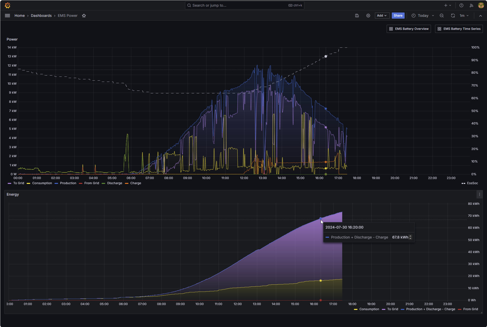
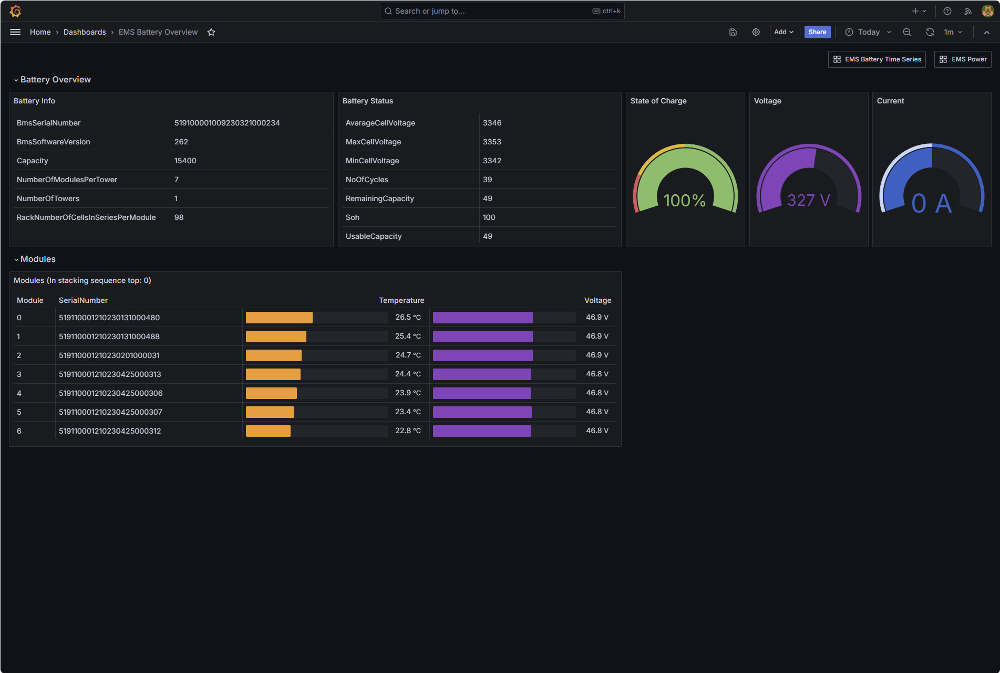
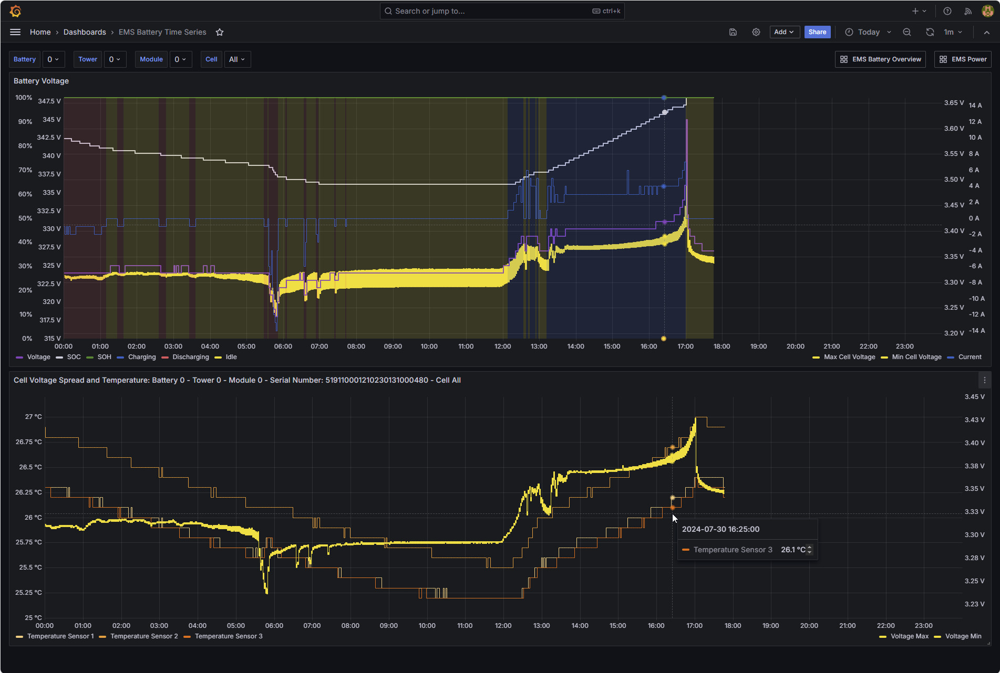

# Visualization Examples

This package includes some examples for visualization based on data confígured in the [monitorEMS_tpl.json](./../config/monitorEMS_tpl.json).     
[Grafana Setup](GrafanaSetup.md) describes how to set up the dashboards in Grafana.

## Dashboard EMS Power

The upper part of this dashboard is essentially the same as the standard OpenEMS [Energy Monitor](https://github.com/OpenEMS/openems?tab=readme-ov-file#openems-ui-screenshots) dashboard, showing power from production, consumption and storage over time together with the State of Charge of the battery.

The lower part shows enrgy over time:    
Consumed energy and energy fed into the grid are stacked.    
The blue line shows net production, considering buffering (production + decharge - charge).    
The red line shows energy obtained from the grid.

## Dashboard Battery Overview

Data for this dashboard are not queried directly from the system.    
Instead, the time of evaluation is the last measurement within the selected period.

The upper left part shows two tables with static and dynamic battery characteristics.
The upper right part shows State of Charge, Voltage and Current. Negative current indicates discharging.

The table in the lower part represents the battery modules with their serial number, their temperature (average of three sensors) and their total voltage (sum of cell voltages).   
The sequence represents stacking of the modules with module 0 being the uppermost.

## Dashboard Battery Time Series

This dashboard shows some characteristics of the storage system over time.

The selector drop-downs allow selecting battery, tower, module and cell. Instead of an individual cell, you may also choose "All".

The upper part of the dashboard refers to the entire battery system (more precisely: the selected tower).    
It shows voltage and current as well as State of Charge and State of Health.    
Shaded areas indicate phases of charging, decharging as well as idle status,    
The yellow area shows the spread between minimum and maximum cell voltage within the tower.

The bottom part refers to the selected module, for which the temperatures from the three sensors are drawn.   
If Cell=All is selected, the yellow area shows the spread between minimum and maximum cell voltage for the selected module.   
If a specific cell is selected, the voltage for this cell is drawn.